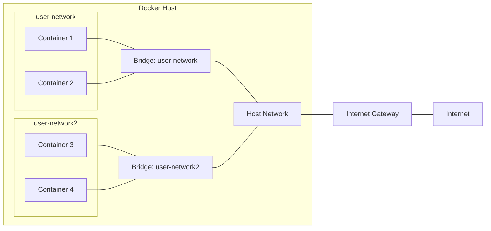

# 🌉 Unraveling the Mysteries of Docker Bridge Networks

[](https://github.com/TheToriqul/docker-bridge-networks)
[](https://github.com/TheToriqul/docker-bridge-networks/stargazers)


## 📋 Project Overview

As a passionate learner and technology enthusiast, I embarked on a journey to unravel the mysteries of Docker bridge networks. This project represents my hands-on exploration of creating custom bridge networks, attaching containers to multiple networks, and leveraging powerful tools like `ip` and `nmap` to examine network configurations and discover other containers.

Through this project, I aimed to gain a deep understanding of Docker networking concepts and develop the skills necessary to design and manage complex network architectures in containerized environments. By sharing my findings and experiences, I hope to inspire others to dive into the fascinating world of Docker networking and empower them to build robust and secure containerized applications.

## 🎯 Key Objectives

- Gain hands-on experience with creating and configuring custom bridge networks in Docker
- Understand the benefits and use cases of attaching containers to multiple networks
- Master the usage of `ip` command for examining network interfaces and IP addresses
- Explore the capabilities of `nmap` for network scanning and container discovery
- Develop a strong foundation in Docker networking concepts and best practices

## 🏗️ Project Architecture

The project implements a multi-layered network architecture utilizing Docker's native networking capabilities and custom bridge networks.

## 💻 Technical Stack

-  Docker: Containerization platform
-  Alpine Linux: Lightweight container base image
-  Bash: Scripting for automation and command execution

## 🚀 Getting Started

<details>
<summary>🐳 Prerequisites</summary>

- Docker installed on your machine
- Basic understanding of Docker concepts and commands

</details>

<details>
<summary>⚙️ Installation</summary>

1. Clone the repository:
   ```
   git clone https://github.com/TheToriqul/docker-bridge-networks.git
   ```
2. Navigate to the project directory:
   ```
   cd docker-bridge-networks
   ```

</details>

<details>
<summary>🎮 Usage</summary>

1. Create custom bridge networks:
   ```
   docker network create --driver bridge user-network
   docker network create --driver bridge user-network2
   ```

2. Launch containers and attach them to networks:
   ```
   docker run -dit --name container1 --network user-network alpine:latest
   docker run -dit --name container2 --network user-network alpine:latest
   docker run -dit --name container3 --network user-network2 alpine:latest
   docker run -dit --name container4 --network user-network2 alpine:latest
   ```

3. Connect containers to additional networks:
   ```
   docker network connect user-network2 container1
   ```

4. Examine network interfaces and IP addresses:
   ```
   docker exec -it container1 ip addr
   ```

5. Install and use `nmap` for network scanning:
   ```
   docker exec -it container1 apk add --no-cache nmap
   docker exec -it container1 nmap -sn 172.18.0.0/16
   ```

For detailed commands and explanations, refer to the [reference-commands.md](reference-commands.md) file.

</details>

## 💡 Key Learnings

### Technical Mastery
- Mastered the creation and configuration of custom bridge networks in Docker
- Gained expertise in attaching containers to multiple networks for enhanced connectivity
- Developed proficiency in using `ip` command to examine network interfaces and IP addresses
- Acquired skills in utilizing `nmap` for efficient network scanning and container discovery
- Strengthened problem-solving abilities and debugging techniques for Docker networking issues
- Enhanced understanding of network segmentation, isolation, and security best practices

### Professional Growth
- Designing resilient and scalable network architectures
- Troubleshooting and debugging network issues in containerized environments
- Enhancing security through network segmentation and isolation
- Collaborating with team members on complex network setups
- Documenting and sharing knowledge on Docker networking best practices


## 🔮 Future Enhancements

- Implement automated network provisioning using infrastructure as code tools like Terraform
- Explore overlay networks for seamless multi-host container communication
- Integrate with container orchestration platforms like Kubernetes for scalable networking
- Develop custom network plugins to extend Docker's networking capabilities
- Conduct performance analysis and optimization of network configurations
- Contribute to open-source Docker networking projects and tools

## 🙌 Contribution

I welcome contributions, feedback, and suggestions from the community! If you have any ideas to improve this project or want to collaborate, please feel free to [open an issue](https://github.com/TheToriqul/docker-bridge-networks/issues) or submit a [pull request](https://github.com/TheToriqul/docker-bridge-networks/pulls).

## 📧 Connect with Me

- 📧 Email: toriqul.int@gmail.com
- 📱 Phone: +65 8936 7705, +8801765 939006
- 🌐 LinkedIn: [Md Toriqul Islam](https://www.linkedin.com/in/thetoriqul/)
- 🐙 GitHub: [TheToriqul](https://github.com/TheToriqul)
- 🌍 Portfolio: [The Toriqul](https://thetoriqul.com)

Let's connect and discuss all things Docker, networking, and beyond!

---

Thank you for visiting this repository and joining me on this exciting learning journey. I hope you find the project insightful and valuable. Happy networking! 🚀
