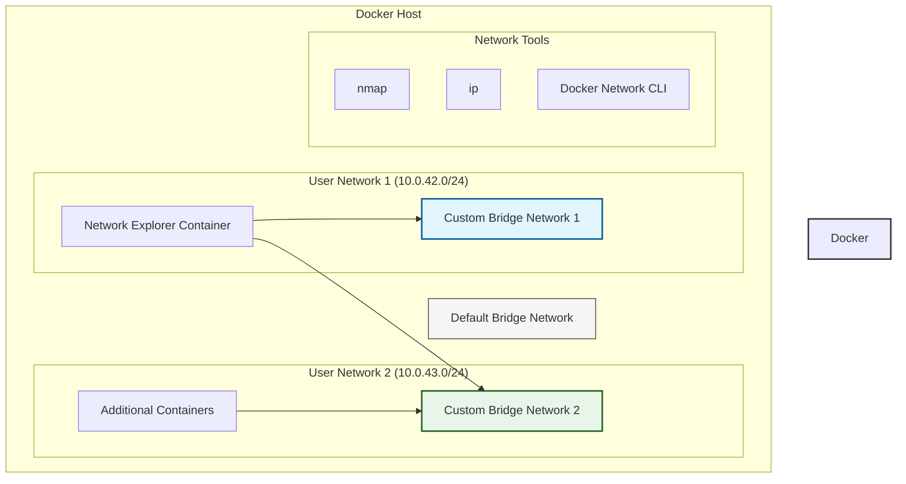

# 🌐 Docker Network Navigator: Advanced Bridge Network Implementation

[](https://github.com/TheToriqul/docker-bridge-networks)
[](https://www.docker.com/)
[](https://www.alpinelinux.org/)
[](https://docs.docker.com/network/bridge/)

## 📋 Overview

Docker Network Navigator is an advanced implementation showcasing the power and flexibility of Docker bridge networks. This project demonstrates sophisticated network configurations, multi-network container attachments, and network analysis using industry-standard tools. It serves as both a practical implementation and a comprehensive learning resource for Docker networking concepts.

## 🏗 Technical Architecture

The project implements a multi-layered network architecture utilizing Docker's native networking capabilities and custom bridge networks.



## 💻 Technical Stack

- **Container Runtime**: Docker 20.10+
- **Base Image**: Alpine Linux 3.8
- **Networking Tools**: 
  - Docker Bridge Networks
  - nmap
  - ip command suite
- **Network Configuration**:
  - Custom subnets
  - IP range management
  - Multiple network attachment

## ⭐ Key Features

1. **Custom Bridge Network Creation**
   - Configurable subnet ranges
   - IP range management
   - Network isolation

2. **Multi-Network Container Management**
   - Container attachment to multiple networks
   - Network isolation and segmentation
   - Cross-network communication

3. **Network Analysis Tools Integration**
   - nmap network scanning
   - IP configuration management
   - Network discovery capabilities

4. **Advanced Network Configuration**
   - Custom subnet definition
   - IP range specification
   - Network labels and metadata

## 📚 Learning Journey

### Technical Mastery:

1. Docker networking architecture and implementation
2. Network segmentation and isolation strategies
3. Container-to-container communication patterns
4. Network security and access control
5. Network troubleshooting and analysis

### Professional Development:

1. Network architecture design
2. Infrastructure documentation
3. Security best practices implementation
4. System analysis and debugging
5. Technical documentation creation

## 🔄 Future Enhancements

<details>
<summary>View Planned Improvements</summary>

1. Integration with Docker Swarm for distributed networking
2. Implementation of network policies and access controls
3. Advanced network monitoring and metrics collection
4. Automated network configuration and deployment
5. Network performance optimization techniques
6. Integration with container orchestration platforms
</details>

## ⚙️ Installation

<details>
<summary>View Installation Details</summary>

### Prerequisites

- Docker Engine 20.10+
- Linux-based operating system
- Basic understanding of networking concepts

### Setup Steps

1. Clone the repository:
   ```bash
   git clone https://github.com/TheToriqul/docker-bridge-networks.git
   ```

2. Navigate to the project directory:
   ```bash
   cd docker-bridge-networks
   ```

3. Ensure Docker is running:
   ```bash
   docker --version
   ```

</details>

## 📖 Usage Guide

<details>
<summary>View Usage Details</summary>

### Basic Usage

1. Create custom networks using the provided commands
2. Launch containers with specific network configurations
3. Use network analysis tools to explore the setup

### Advanced Features

- Multiple network attachment
- Custom subnet configuration
- Network scanning and analysis

### Troubleshooting

- Network connectivity issues
- IP address conflicts
- Container communication problems

</details>

## 📫 Contact

- 📧 Email: toriqul.int@gmail.com
- 📱 Phone: +65 8936 7705, +8801765 939006

## 🔗 Project Links

- [GitHub Repository](https://github.com/TheToriqul/docker-bridge-networks)
- [Portfolio](https://thetoriqul.com)

## 👏 Acknowledgments

- [Poridhi for excellent labs](https://poridhi.io/)
- Docker documentation and community
- Network security research community
- Open source networking tools contributors

---

Feel free to explore, modify, and build upon this configuration as part of my learning journey. You're also welcome to learn from it, and I wish you the best of luck!